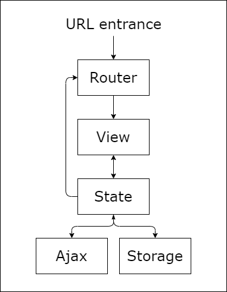

# Architecture

## Overview

ZCTF-Vue is the frontend of a web application that allows users to participate in ZCTF competitions and view their progress. It is built using the following technologies:

- Vue.js: The frontend framework used to build the user interface.
- Vue Router: A routing library that allows the application to display different views based on the user's current location.
- Pinia: A state management library that allows the application to store and manage application state.
- Vite: A build tool that allows the application to bundle and optimize the code for production.
- Element-Plus: A component library that provides a set of high-quality components for building user interfaces.
- Vitest: A testing framework that allows the application to write and run unit tests.
- Cypress: A testing framework that allows the application to write and run end-to-end tests.

## Project Structure

The project is structured as follows:

```sh
.
|-- README.md
|-- cypress
|   |-- e2e
|   |-- fixtures
|   `-- support
|-- cypress.config.js
|-- docs
|   `-- Architecture.md
|-- index.html
|-- jsconfig.json
|-- package-lock.json
|-- package.json
|-- public
|   `-- favicon.ico
|-- src
|   |-- App.vue
|   |-- api
|   |-- assets
|   |-- components
|   |-- composables
|   |-- main.js
|   |-- router
|   |-- stores
|   `-- views
|-- vite.config.js
`-- vitest.config.js
```

## Modules

The frontend of the application is divided into several modules:

- **View module**: This module contains the views that the user can see in the application.
- **Ajax module**: This module contains functions that make HTTP requests to the server.
- **Router module**: This module contains the routing logic that determines which view to display based on the user's current location.
- **State module**: This module contains the state management logic that allows the application to store and manage application state.
- **Storage module**: This module contains functions that allow the application to store and retrieve data from local storage.

<center></center>

### View module

Views are the components that the user can see in the application. They are located in the `views` directory. Each view is a main page of the application, such as the home page, the competitions page, or the user profile page.

Views are under control of the `router` module. The `router` module determines which view to display based on the user's current location.

Views render data from the `state` module. The `state` module stores and manages application state.

### Ajax module

The `ajax` module contains functions that make HTTP requests to the server. It uses the `axios` library to make HTTP requests, fetching data from the server and updating the `state` module with the response data.

Ajax also needs information from the `state` such as the user's token to make proper ajax requests.

### Router module

The `router` module contains the routing logic that determines which view to display based on the user's current location. It uses the `vue-router` library to define the routes and map them to the corresponding views.

Router guard needs information from the `state` module to determine whether the user is authenticated or not. Router guard also call the `state` actions to make ajax requests to preload the data that needs to be displayed on the Views.

### State module

The `state` module contains the state management logic that allows the application to store and manage application state. It uses the `pinia` library to define the state and store it in a centralized location. The `state` module offer necessary data and actions to other modules such as `views`, `router`, and `ajax`.

The `state` module also loads data from the `storage` module when the application starts. 

### Storage module

The `storage` module contains functions that allow the application to store and retrieve data from local storage / cookies. It uses the `js-cookie` library and web api `localStorage` to store and retrieve data. The `storage` module is just a customized plugin for pinia.

The `storage` module stores data in `state` module when the application is about to be terminated.
